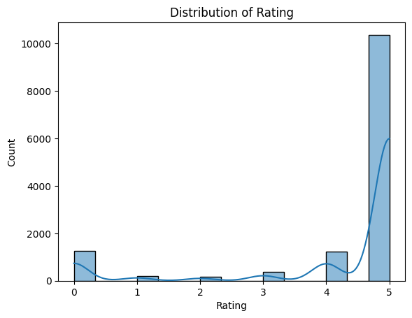
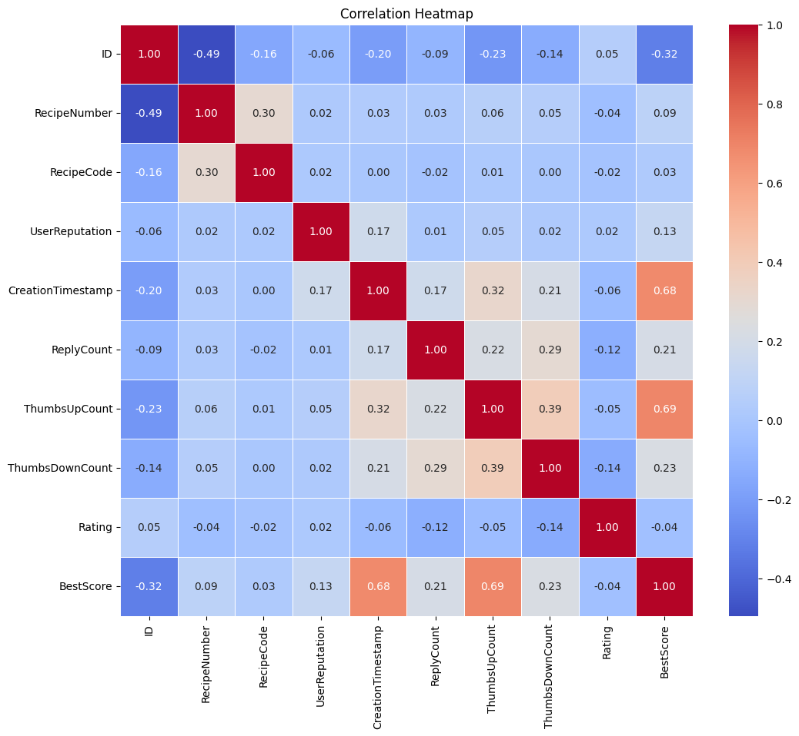
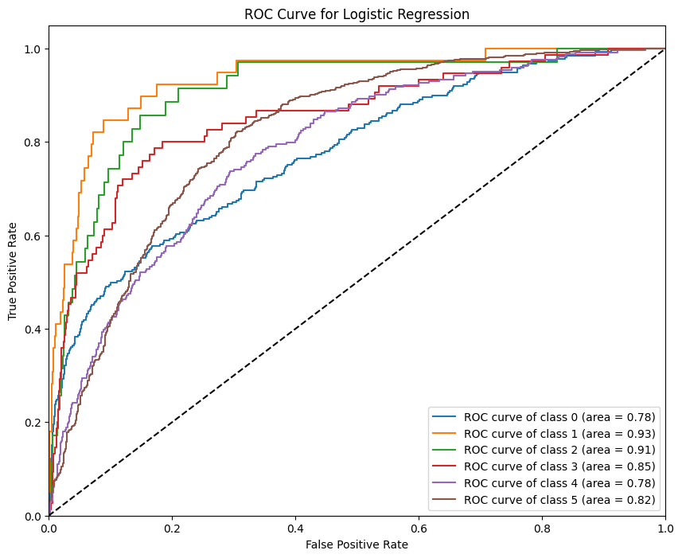
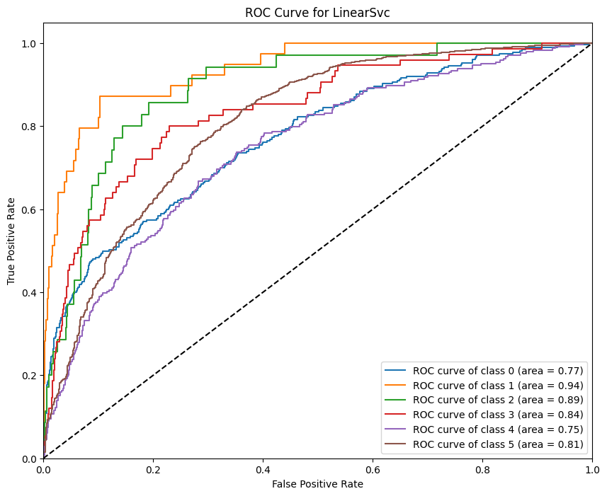
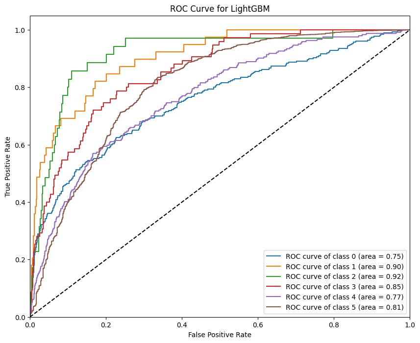
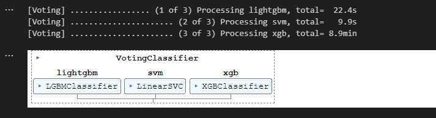

# Recipe-for-Rating-Predict-Food-Ratings-using-ML

Best Score **0.793**

**Data Source:** [Kaggle Recipe for Rating Dataset](https://www.kaggle.com/competitions/recipe-for-rating-predict-food-ratings-using-ml) competition was hosted by IIT Madras

The above competition is a multiclass classification problem.

Data is imbalanced and bised towards rating 5

Data Distribution

Correlation Between Columns

Tried and tested on 4 different models
- Logistic Regression
- LinearSvc
- LightGBM
- XGBoost

 

**Roc for logistic Regression**

 

**Roc for Linear Svc**

 

**Roc for LightGBM**

Voting Classifier to make prediction on test dataset

got the best score on **0.793**